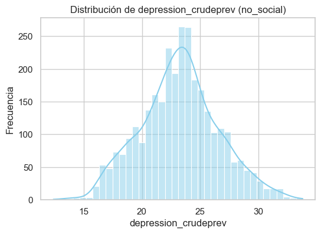
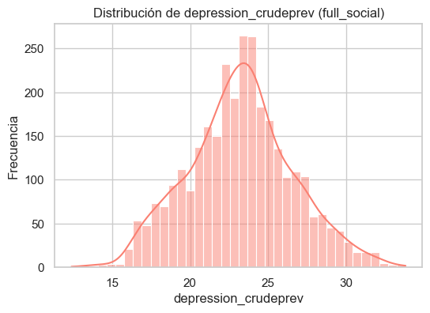
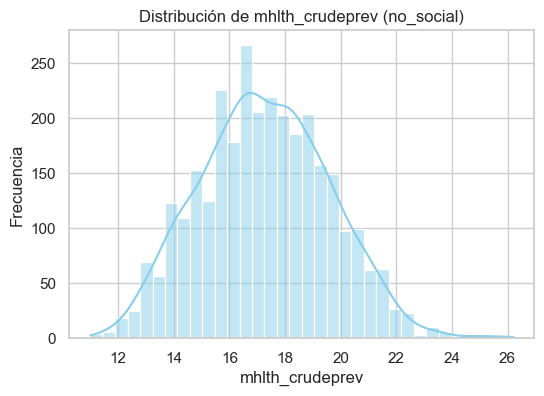
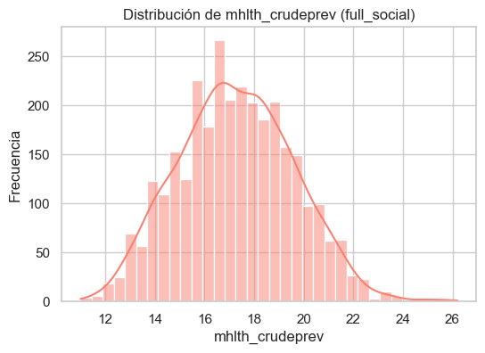

# 🧠 CityMind - Exploratory Data Analysis (EDA)
**Fecha de ejecución:** 2025-10-09 19:51

## 📂 Información general
- No Social → 3077 filas × 39 columnas
- Full Social → 3077 filas × 46 columnas

## 📊 Correlaciones más altas
| target               | dataset     | feature              |     corr |
|:---------------------|:------------|:---------------------|---------:|
| depression_crudeprev | no_social   | depression_crudeprev | 1        |
| depression_crudeprev | no_social   | mhlth_crudeprev      | 0.715744 |
| depression_crudeprev | no_social   | casthma_crudeprev    | 0.635076 |
| depression_crudeprev | no_social   | cognition_crudeprev  | 0.576686 |
| depression_crudeprev | no_social   | copd_crudeprev       | 0.487477 |
| depression_crudeprev | no_social   | phlth_crudeprev      | 0.481165 |
| depression_crudeprev | no_social   | disability_crudeprev | 0.477499 |
| depression_crudeprev | no_social   | csmoking_crudeprev   | 0.442744 |
| depression_crudeprev | no_social   | indeplive_crudeprev  | 0.39329  |
| depression_crudeprev | no_social   | ghlth_crudeprev      | 0.360864 |
| depression_crudeprev | full_social | depression_crudeprev | 1        |
| depression_crudeprev | full_social | mhlth_crudeprev      | 0.715744 |
| depression_crudeprev | full_social | casthma_crudeprev    | 0.635076 |
| depression_crudeprev | full_social | cognition_crudeprev  | 0.576686 |
| depression_crudeprev | full_social | copd_crudeprev       | 0.487477 |
| depression_crudeprev | full_social | phlth_crudeprev      | 0.481165 |
| depression_crudeprev | full_social | disability_crudeprev | 0.477499 |
| depression_crudeprev | full_social | csmoking_crudeprev   | 0.442744 |
| depression_crudeprev | full_social | indeplive_crudeprev  | 0.39329  |
| depression_crudeprev | full_social | ghlth_crudeprev      | 0.360864 |
| mhlth_crudeprev      | no_social   | mhlth_crudeprev      | 1        |
| mhlth_crudeprev      | no_social   | cognition_crudeprev  | 0.893899 |
| mhlth_crudeprev      | no_social   | indeplive_crudeprev  | 0.774104 |
| mhlth_crudeprev      | no_social   | disability_crudeprev | 0.731158 |
| mhlth_crudeprev      | no_social   | phlth_crudeprev      | 0.730317 |
| mhlth_crudeprev      | no_social   | ghlth_crudeprev      | 0.728441 |
| mhlth_crudeprev      | no_social   | sleep_crudeprev      | 0.723096 |
| mhlth_crudeprev      | no_social   | depression_crudeprev | 0.715744 |
| mhlth_crudeprev      | no_social   | csmoking_crudeprev   | 0.715667 |
| mhlth_crudeprev      | no_social   | casthma_crudeprev    | 0.681873 |
| mhlth_crudeprev      | full_social | mhlth_crudeprev      | 1        |
| mhlth_crudeprev      | full_social | cognition_crudeprev  | 0.893899 |
| mhlth_crudeprev      | full_social | indeplive_crudeprev  | 0.774104 |
| mhlth_crudeprev      | full_social | disability_crudeprev | 0.731158 |
| mhlth_crudeprev      | full_social | phlth_crudeprev      | 0.730317 |
| mhlth_crudeprev      | full_social | ghlth_crudeprev      | 0.728441 |
| mhlth_crudeprev      | full_social | sleep_crudeprev      | 0.723096 |
| mhlth_crudeprev      | full_social | depression_crudeprev | 0.715744 |
| mhlth_crudeprev      | full_social | csmoking_crudeprev   | 0.715667 |
| mhlth_crudeprev      | full_social | casthma_crudeprev    | 0.681873 |

## 📈 Distribuciones principales
- 
- 
- 
- 

## 💡 Observaciones automáticas
- El dataset **Full Social** incluye más variables (indicadores socioeconómicos) pero mantiene correlaciones muy similares.
- `mhlth_crudeprev` muestra correlaciones más fuertes que `depression_crudeprev`, indicando una relación más estable.
- Los histogramas muestran una distribución coherente entre ambos escenarios, validando el preprocesamiento.

